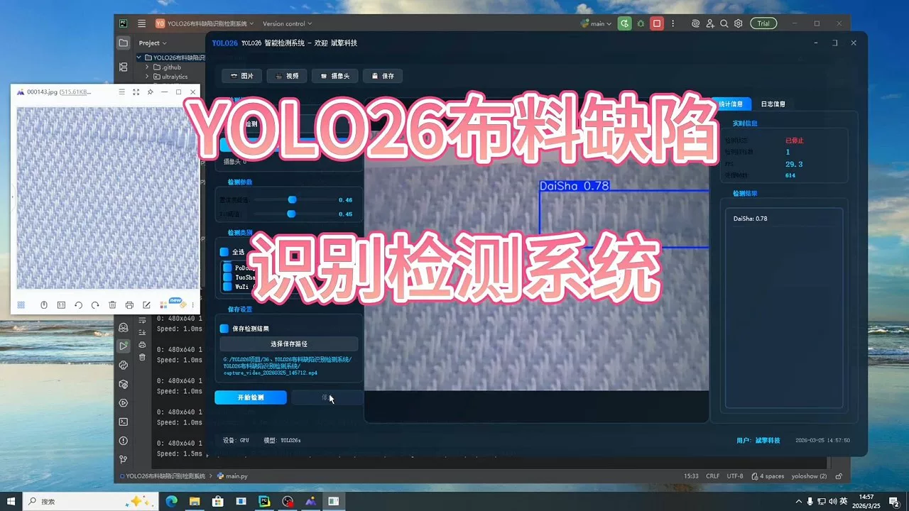
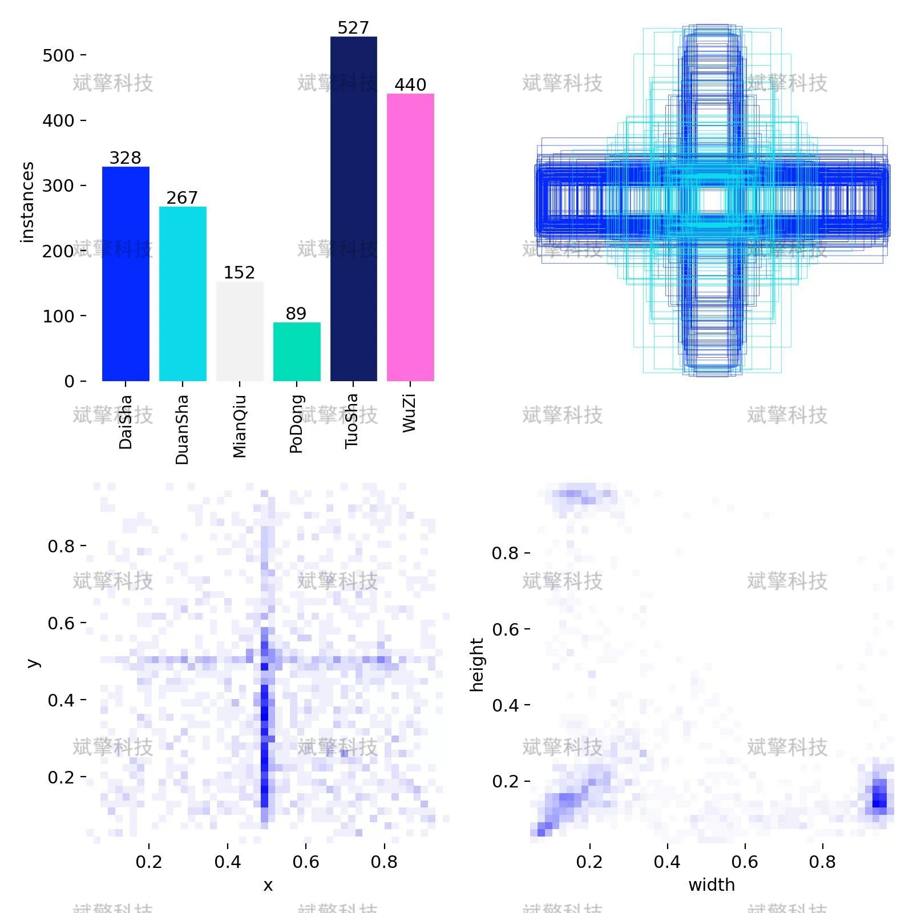
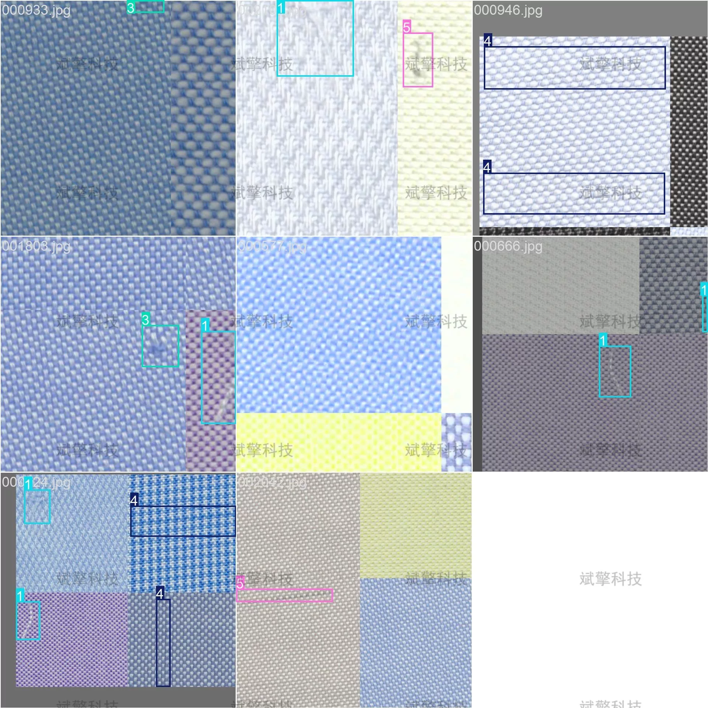
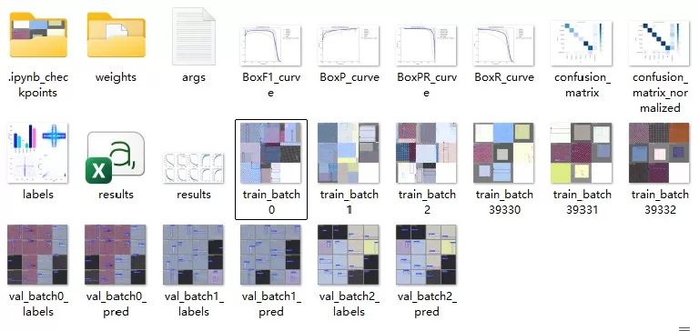
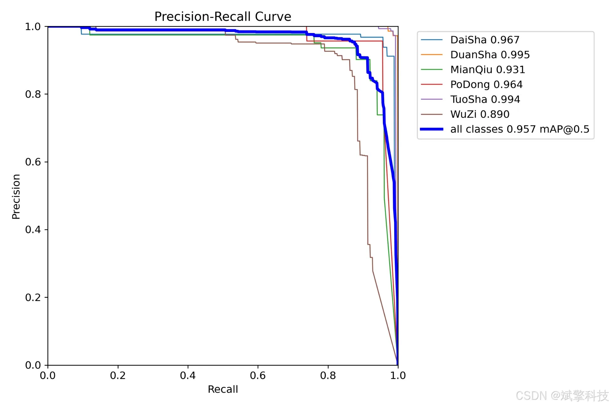
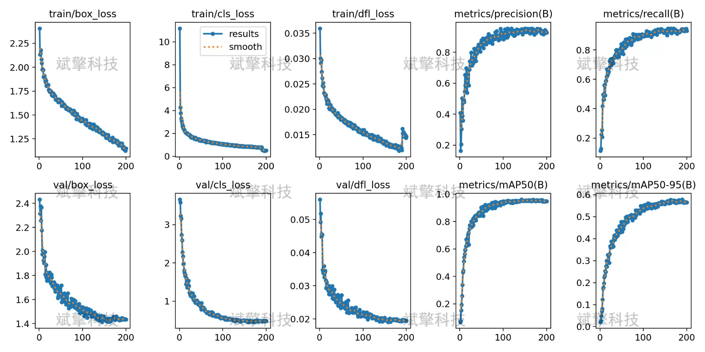
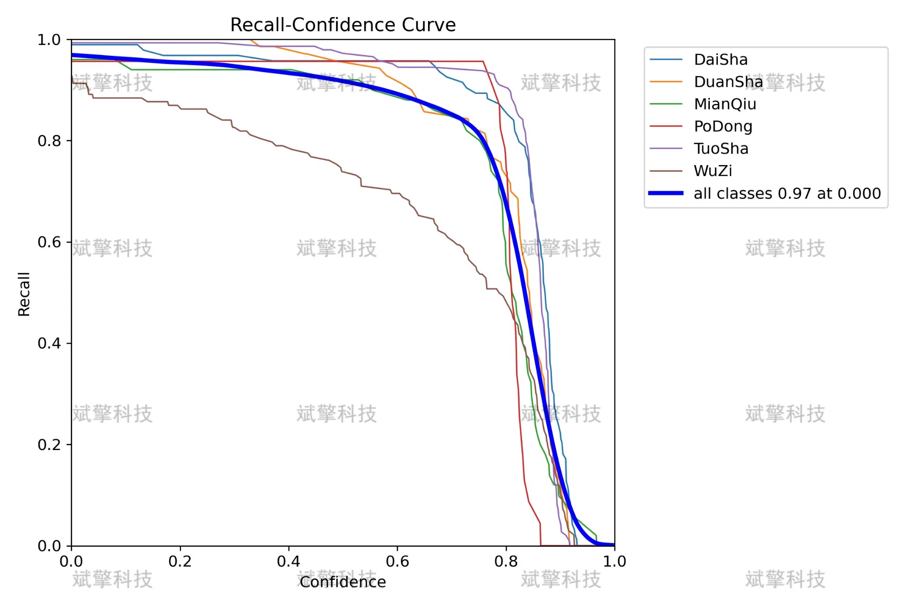
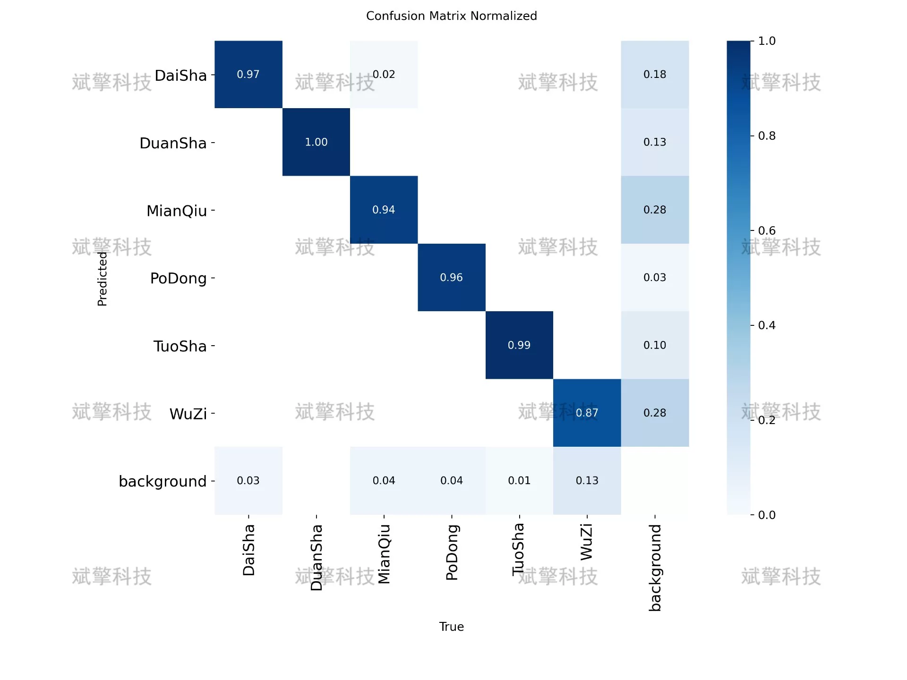
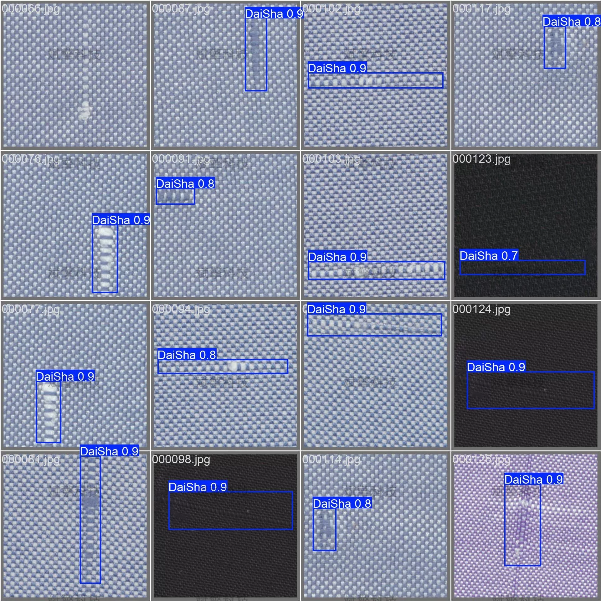

# YOLOv26 fabric defect detection system | dataset

## Body

YOLO26 Fabric Defect Detection System | Data Set: Say Goodbye to Manual Inspection: YOLO26 Achieves Automated Detection of Fabric Defects (Project Source Code + Data Set + Model Weights + UI Interface + Python + Deep Learning + Remote Environment Deployment)

This research report is based on the YOLO26 object detection algorithm and has built an intelligent recognition detection system for six common defects in fabric production. The dataset used in this study includes 1650 training images and 467 validation images, covering six categories including yarn breakage, thread breakage, cotton ball, hole, unraveling, and stain.
Through the training and evaluation of the YOLO26 model, the system achieved excellent detection performance with mAP@0.5 at 95.7% on the test set. Experimental results show that, except for the stain category with a recognition rate of 89%, the recognition rates for the other five categories are all above 93%, with the recognition rates for breakage and unraveling reaching 99.5% and 99.4% respectively. The confusion matrix analysis indicates that the model has good classification ability and low false positive rates. This study provides a high-efficiency, accurate automated solution for fabric quality inspection.
Number of defect categories: 6
Category names: ['DaiSha' (yarn breakage), 'DuanSha' (thread breakage), 'MianQiu' (cotton ball), 'PoDong' (hole), 'TuoSha' (unraveling), 'WuZi' (stain)]
Total number of labeled images: 2117
Training set: 1650 images (78%)
Validation set: 467 images (22%)

Free remote installation appointment. Unsuccessful full refund.
Purchase Enjoy the following resources (Baidu Drive automatically unlocked)
   YOLO Identification Detection Project Complete Source Code
   YOLO formatted dataset
    Training code + UI interface code
    Trained model + result images
    Software installer package
    Add WeChat for remote installation (Automatically display WeChat ID after purchase) - Unsuccessful, full refund

⚙️ Core function modules
Detection capabilities
    Image detection: upload and check immediately, return detection box + category information
    Video detection: supports video files, analyzes frames accurately
    Camera real-time detection: connects to USB camera, realizes dynamic monitoring
Interaction and control
    Target selection: freely choose one or more categories for detection
    Parameter adjustment: adjustable confidence threshold & IoU threshold, flexible control accuracy
    Result saving: save images/videos/camera detection results in one click
System and data
    User login registration: Support password strength checking + encryption storage
    Log recording: automatically records operation and error information (timestamped)

## Images

## Payment

Here is a pay link on Stripe ( https://buy.stripe.com/3cs8yP7sY87d0vu9AB ). Please contact me lonlonago@foxmail.com after funding $89, and I will send you a complete data files , thank you!

